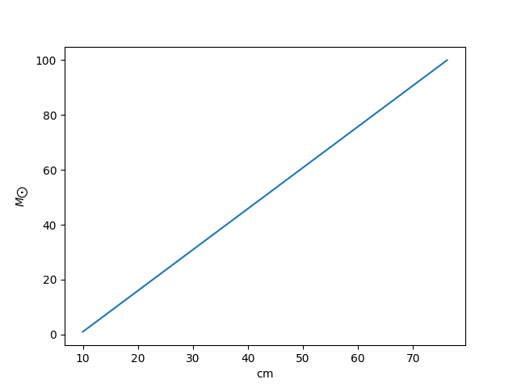

# OOMpy a/k/a order-of-magnitude python

[](https://github.com/haykh/oompy/actions/workflows/github-pytest.yml)

OOMpy is a python package for working with physical units and quantities. Unlike `astropy` it works in gaussian units, supports a multitude of physical dimensions, constants, and conversion between them (including vague conversions between incompatible units). 

## Installation

```sh
pip install oompy
```

## Usage

Importing the main objects:
```python
# import units and constants
from oompy import Units as u
from oompy import Constants as c
```

### Simple manipulations and unit conversions

Several common usage examples:
```python
# example #1
m_m87 = 6.5e9 * u.Msun
rg_m87 = c.G * m_m87 / c.c**2
rg_m87 >> 'au'
#       ^
#       |
# basic conversion
#
# Output: 64.16104122314108 au
```

```python
# example #2
psr_bfield = 1e12 * u.G    # magnetic field in Gauss
gold_density = 19.3 * u.g / u.cm**3
((psr_bfield / c.c)**2).cgs
#                        ^
#                        |
#                 convert to cgs
#
# Output: 1112.6500560536185 g cm^-3
#
# equivalently:
((psr_bfield / c.c)**2).cgs >> "CGS"
#
# Output: 1112.6500560536185 g cm^-3
#
(psr_bfield / c.c)**2 / gold_density >> ""
#
# Output: 57.650261971690085
```

```python
# example #3
gamma_factor = 1000
b_field = u.MG        # = Mega Gauss 
omega_B = (c.q_e * b_field / (c.m_e * c.c))
sync_omega = gamma_factor**2 * omega_B

c.hbar * sync_omega >> 'keV'
#                       ^
#                       |
#             understands prefixes for the powers of 10
#               (works from 1e-24 "y*" to 1e24 "Y*")
#
# Output: 11.576759893742388 keV
```

```python
# example #4
# compare physical quantities in arbitrary units
(c.R_sun >> 'ly') == c.R_sun # True
c.M_sun < (c.m_e >> "lb") # False
c.R_sun >= (c.m_e >> "lb") # Error: incompatible units
```

```python
# example #5
# formatting
print (f"rest-mass energy of an electron is {c.m_e * c.c**2 >> 'MeV':.2f}")
#
# Output: rest-mass energy of an electron is 0.51 MeV
```

```python
# example #6
# get the reduced physical type of the quantity (i.e., dimension in base units)
# can be utilized for further parsing, integration to other APIs, etc.
~(c.hbar * sync_omega)
#
# Output: {<Type.MASS: 3>: Fraction(1, 1), <Type.LENGTH: 1>: Fraction(2, 1), <Type.TIME: 2>: Fraction(-2, 1)}
```

To see all units and/or constants:
```python
u.all
c.all
```

Create your own quantities:
```python
from oompy import Quantity
# example #7
my_speed = Quantity('25 m sec^-1')
#                      ^
#                      |
#                 as a string
rabbit_speed = Quantity(55, 'mi hr^-1')
#                         ^
#                         |
#                     as a tuple
elephant_speed = Quantity('km hr^-1')
(elephant_speed * my_speed / rabbit_speed) >> 'ly Gyr^-1'
#                                                  ^
#                                                  |
#                                           converts lightyear per Gigayear :)
#
# Output: 0.9421232705492877 ly Gyr^-1
#
# more concise way:
rabbit_speed2 = 55 * u.mi / u.hr
```

### Vague conversions
This technique enables a comparison between incompatible units under certain assumptions. For instance, one might assume that we consider a photon, and thus its energy, wavelength and frequency are connected via `c` and `h`. 

```python
from oompy import Assumptions as assume, Quantity

# uses h
freq = 5 * u.GHz
freq >> assume.Light >> "cm"
#
# Output: 5.995849160000001 cm

# uses h-bar as freq has a dimension of radians per second
freq = 2 * c.pi * u.rad / u.sec
freq >> assume.Light >> "eV"
#
# Output: 4.1356667496413186e-15 eV

# temperature to/from energy
10000 * u.K >> assume.Thermal >> "eV"
#
# Output: 0.8617339407568576 eV

# compute co-moving distance for a redshift
Quantity(5, "") >> assume.Redshift >> "Gly"
#
# Output: 25.878013331255335 Gly
#
# compute redshift for a co-moving distance
5 * u.Gpc >> assume.Redshift >> ""
#
# Output: 1.8018944589315433
```

To list all the available assumptions:
```python
list(assume)
```

### Matplotlib and numpy support

One can combine dimensional quantities into arrays or lists and plot them using matplotlib:
```python
import numpy as np
import matplotlib.pyplot as plt

# call this function to enable matplotlib support
from oompy import matplotlib_support
matplotlib_support()

ms = np.logspace(0, 2, 2) * u.Msun
rs = [10 * u.cm, 2.5 * u.ft]
#            ^           ^
#       can have different units

plt.plot(rs, ms)
```


## For developers

Testing the code is done in three steps using `black` to check the formatting, `mypy` to check the types and typehints, and `pytest` to run the tests. First install all the dependencies:

```sh
pip install -r requirements.txt
```

Then run the tests one-by-one:

```sh
black oompy --check --diff
mypy oompy
pytest
```

Build the new version of the package using:

```sh
python -m build --sdist --outdir dist .
```

The same tests are also run automatically on every commit using GitHub Actions.

## To do

- [ ] add more units & constants
  - [x] (added in v1.3.5) knots
  - [x] (added in v1.4.1) Rsun
  - [x] (added in v1.4.1) fathom
  - [x] (added in v1.4.1) nautical miles
- [x] (added in v1.1.0) comparison of quantities (`==`, `!=`, `>`, `<`, `>=`, `<=`)
- [x] (added in v1.1.0) conversion with an rshift (`>>`) operator
- [x] (added in v1.1.0) base unit extraction (with `~`)
- [x] (added in v1.2.0) add a possibility to perform vague conversions (e.g. Kelvin to eV, Hz to erg) etc.
- [x] (added in v1.3.0) unit tests
- [ ] add support for Ki, Mi, Gi (2e10, 2e20, 2e30)
- [x] (added in v1.3.5) distance to redshift vague conversion
- [x] (added in v1.4.0) work with numpy arrays
  - [x] (added in v1.4.1) additional tests for numpy arrays
  - [x] (added in v2.0.0) numpy array multiplication works both ways
- [x] (added in v2.0.0) add formatting and TeX support
- [ ] add a way to work with scaling relations
- [x] (added in v1.4.1) add `__format__` for `Quantity` objects
